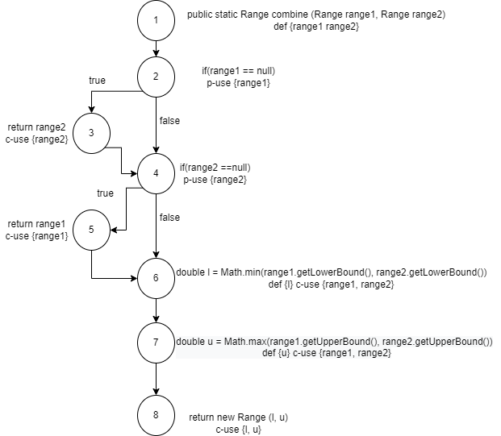

**SENG 438 - Software Testing, Reliability, and Quality**

**Lab. Report #3 – Code Coverage, Adequacy Criteria and Test Case Correlation**

| Group \#:42      |     |
| -------------- | --- |
| Student Names: | Carl Lyss    |
|                | Bhavdeep Purba     |
|                | Mohammadreza Osouli     |
|                | Mohamed Mansour     |

(Note that some labs require individual reports while others require one report
for each group. Please see each lab document for details.)

# 1 Introduction

Text…

# 2 Manual data-flow coverage calculations for X and Y methods

### CalculateColumnTotal data-flow coverage

| Variable | Def | dcu(v,n) | dpu(v,n)        |
| -------- | --- | -------- | --------------- |
| data     |  1  | {3, 5}   | {(2,3), (2,10)} |
| column   |  1  | {5}      | {}              |
| total    |  3  | {7, 9}   | {}              |
| total    |  7  | {7, 9}   | {}              |
| rowCount |  3  | {4}      | {}              |
| r        |  3  | {5, 8}   | {(4,5), (4,9)}  |
| r        |  8  | {5, 8}   | {(4,5), (4,9)}  |
| n        |  5  | {7}      | {(6,7), (6,8)}  |

Test1, `calculateColumnTolalForAllRowsTest()`:
Covers All DU-Pairs expect: `<data, 1, (2, 10)>` and `<n, 5, (6,8)>`

Test2, `calculateColumnTolalForInvalidColoumn()`: 
Same as Test1. Has been implemented in black-box testing to check thrown error.

Test3, `calculateColumnTolalForNullData()`:
Covers `<data, 1, (2,10)>`

Test4, `calculateColumnTotallSkipsNullValues()`:
Covers all DU-Pairs expect: `<data, 1, (2,10)>`

So, The DU-Pair coverage is 100%.

### Range.combine data-flow coverage

| Variable | Def | dcu(v,n) | dpu(v,n)        |
| -------- | --- | -------- | --------------- |
| range1   |  1  | {5,6,7}  | {(2,3), (2,4)}  |
| range2   |  1  | {3,6,7}  | {(4,5), (4,6)}  |
| l        |  6  | {8}      | {}              |
| u        |  7  | {8}      | {}              |

Pair Coverage for each test case:
There are 11 tests for range.combine. They cover the following def-use pairs in order: 
* range1 { (1,2) (1,6), (1,7)}  range2 {(1,4) (1,6), (1,7)}  l {(6,8)}  u {(7,8)}
* range1 { (1,2) (1,6), (1,7)}  range2 {(1,4) (1,6), (1,7)}  l {(6,8)}  u {(7,8)}
* range1 { (1,2) (1,6), (1,7)}  range2 {(1,4) (1,6), (1,7)}  l {(6,8)}  u {(7,8)}
* range1 { (1,2) (1,6), (1,7)}  range2 {(1,4) (1,6), (1,7)}  l {(6,8)}  u {(7,8)}
* range1 { (1,2) (1,5)}  range2 {(1,4)}  l {()}  u {()}
* range1 { (1,2) }  range2 {(1,3)}  l {()}  u {()}
* range1 { (1,2) }  range2 {(1,3)}  l {()}  u {()}
* range1 { (1,2) (1,6), (1,7)}  range2 {(1,4) (1,6), (1,7)}  l {(6,8)}  u {(7,8)}
* range1 { (1,2) (1,6), (1,7)}  range2 {(1,4) (1,6), (1,7)}  l {(6,8)}  u {(7,8)}
* range1 { (1,2) (1,6), (1,7)}  range2 {(1,4) (1,6), (1,7)}  l {(6,8)}  u {(7,8)}
* range1 { (1,2) (1,6), (1,7)}  range2 {(1,4) (1,6), (1,7)}  l {(6,8)}  u {(7,8)}

The DU-Pair coverage is 100%.

# 3 A detailed description of the testing strategy for the new unit test

Text…

# 4 A high level description of five selected test cases you have designed using coverage information, and how they have increased code coverage

Text…

# 5 A detailed report of the coverage achieved of each class and method (a screen shot from the code cover results in green and red color would suffice)

### Range.java

Our methods: 
1. combine(Range, Range)
2. contains(double)
3. getLength()
4. getLowerBound()
5. isNaNRange()

#### Instruction Counter

#### Branch Counter

#### Method Counter

### DataUtilities.java

Our Methods: All Methods (one method has been added in this assignment)

#### Instruction Counter

##### Before improvement

##### After improvement

#### Branch Counter

##### Before improvement

##### After improvement

#### Method Counter

##### Before improvement

##### After improvement

# 6 Pros and Cons of coverage tools used and Metrics you report

We have used EclEmma as the automatic test coverage tool. As it was already installed on eclipse, it was very easy to be used. It has several metrics such as instruction, branch, line, method, type, and complexity counters. The coverage visualization is useful and intuitive like the colors and bars showing coverage information. One of the parts was code highlighting. For each part, the code has been highlighted with colors of green (which means covered code), red (which means uncovered code), and orange (which means partially covered code, such as branches and conditions). We easily discovered our coverage holes using this highlighting tool.

Although it was easy to start, the hierarchy menu of methods was a little annoying. Also, It was showing the whole code coverage when we execute tests for only one class which was unnecessary and made it hard to find the related class. Moreover, the test file was in the coverage itself and it was misleading at the start because it had a high percentage of coverage (which is obvious because we executed the test file directly).  

# 7 A comparison on the advantages and disadvantages of requirements-based test generation and coverage-based test generation.

Coverage based testing is more rigid than requirements based testing. This rigidity allows for effective automation on checking the coverage, enabling quick generation of tests. However to reach high coverage it requires many tests, more than we generated with requirements based generation.  This coverage can show areas of code that are untested, and even if no tests are created for them, then if a bug is still found you can look at the uncovered areas first, possibly increasing the rate of bug fixing. 

Requirements based testing allowed for us to focus on the areas that were most likely to have faults, while coverage based testing treats all segments of code as equal for testing. 

An interesting thing to note is that even though we had a more powerful test set with coverage based testing, we found no additional bugs compared to our requirements based testing. This provides some evidence to the argument that the coverage based testing isn’t the most efficient use of time.  

# 8 A discussion on how the teamwork/effort was divided and managed

We separated our group into two teams as we did in last assignment. Carl and Mohamed have written the tests for Range class in last assignment, and they were aware of different aspects of this class. Bhavdeep and Mohammadreza have worked on the DataUtilities class and knew about this class more than others. So we decided to have the same teams as we had in last assignment to make the progress faster. In each group, both team members observed the coverage values of different methods and discussed on the way of improvment.

At the end, all members of the group collect their experience together to write the report. 

# 9 Any difficulties encountered, challenges overcome, and lessons learned from performing the lab

Text…

# 10 Comments/feedback on the lab itself

This assignment is so usefull as white-box testing and coverage are very common in the industry. It was so good that white-box testing was the follow-up for black-box testing we had in the last assignment. So, we think that this assignment was overally practical.

The tool we used was not able to do condition coverage so we did method coverage instead, but the method coverage is not practical enough for this assignment because we had to write tests for 5 methods in the last assignments and all those methods are going to be counted as coverage (which is not showing anything about the quality of our tests). So, replacing method coverage with some other coverage, or reducing the number of reported counters from 3 to 2 may be more practical.
